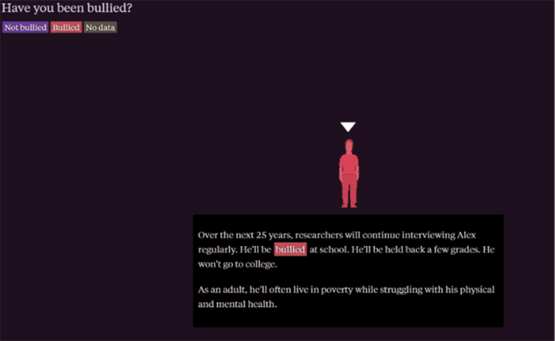
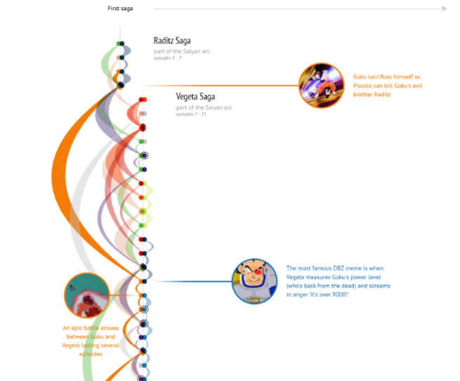

# Proyecto de investigación sobre siniestros ferroviarios en Chile

**Síntesis del proyecto:**

La seguridad en el transporte ferroviario en Chile enfrenta un desafío importante respecto a las muertes por atropello en las vías férreas, un tema que ha evidenciado cifras preocupantes en los últimos años. Entre 2017 y abril de 2025, según una base de datos inédita entregada por la Prefectura Técnica y Seguridad Vial de Carabineros de Chile, se documentaron múltiples fallas por siniestros ferroviarios del tipo atropello a nivel nacional. Estos datos incluyen detalles como región, año, género, edad y causas de los accidentes, lo que permite un análisis detallado del fenómeno y su persistencia en el tiempo. 

El informe nacional de la Comisión Nacional de Seguridad de Tránsito (Conaset) sobre siniestros ferroviarios en el período 2014-2023 aporta antecedentes clave para contextualizar la problemática. En promedio, ocurren cerca de 90 siniestros ferroviarios anuales, que resultan en aproximadamente 31 fallecidos y 56 lesionados cada año. La mayoría de estos accidentes son atropellos (45,6%), seguidos por colisiones (33%). Estos siniestros se concentran principalmente en zonas urbanas de alta densidad peatonal, reflejando la vulnerabilidad de los usuarios cercanos a las vías férreas y la necesidad de reforzar la infraestructura y la señalización adecuada. 

Históricamente, Chile ha experimentado varios accidentes ferroviarios significativos que han marcado tanto el desarrollo de la red ferroviaria como la percepción pública sobre la seguridad en este medio. Desde accidentes emblemáticos del siglo XX como el de San Bernardo de 1955, donde fallecieron 45 personas, hasta incidentes recientes como el choque frontal de San Bernardo en 2024, la seguridad ferroviaria sigue siendo un desafío crítico. Pese a avances tecnológicos y normativos, la frecuencia y gravedad de los siniestros en las vías detectadas entre 2014 y 2023 indican que no ha habido una reducción sustancial en las víctimas. 

**Hipótesis:**
Mientras se potencia el sistema ferroviario nacional desde el Gobierno, cada año mueren personas atropelladas por trenes en Chile. 
La falta de medidas adecuadas de seguridad vial está limitando el desarrollo seguro y eficiente de este medio de transporte. 

**Antecedentes del tema:**

Ha sido publicado el informe nacional de la Comisión Nacional de Seguridad de Tránsito (Conaset) sobre siniestros ferroviarios en el período 2014-2023. El enfoque ha sido mostrar los datos, a fin de analizarlos y servir de insumo para la generación de políticas públicas. Los hechos claves que se han presentado del problema, según datos del informe, dicen relación con que “(...) los siniestros ferroviarios y sus consecuencias han registrado variaciones significativas desde 2014, aumentando la cantidad de siniestros en un 15,8%, fallecidos en un 14,3% y lesionados en un 3,8%”.  

**Datos:**

Para probar nuestra hipótesis, primero vamos a necesitar de datos actualizados, en los que se plasme como con el avanzar de los años, han ido al alza los accidentes ferroviarios durante los últimos 10 a 15 años.  

Estos datos deben ahondar en el tipo de accidente ocurrido, con el fin de categorizar estos y hacer una comparativa. También, debemos tener en cuenta la gravedad de los siniestros, como si estos resultaron con víctimas fatales o lesionados de gravedad. Por último, se debe revisar el tipo de servicio que el tren ofrecía, ya sea como medio de transporte para personas o de comercio, más que nada, para poder distinguir alguna tendencia. 

**¿Qué datos tiene y qué datos necesita conseguir aún?**

Contamos actualmente con datos que abordan la cantidad de accidentes ferroviarios en Chile desde al menos 10 años, en conjunto con un desglose del tipo de siniestro ocurrido. En ellos se abordan clasificaciones, y se caracteriza de manera general a los afectados por los siniestros. 

Aún debemos conseguir datos sobre el crecimiento de la red ferroviaria en Chile y cuál ha sido la efectividad de nuevos protocolos de seguridad que se hayan implementado en los últimos años. 

**¿Qué datos no existen y cómo los obtendrá?**

No hay una caracterización detallada año a año de las personas que se ven involucradas en este tipo de accidentes, el informe de CONASET cuenta con el total de personas durante el periodo de 9 años. Para poder obtener esta información, podemos contactar con CONASET para poder acceder a esos datos más específicos. 

**¿Qué datos son públicos y cuáles no?**

Los datos con los que contamos actualmente son públicos, estos provienen desde CONASET y del Instituto de Estadística (INE). Se puede acceder a ellos a través de internet. 

Los datos que no son públicos serían un desglose detallado en el que se caracterice a las personas involucradas en los accidentes ferroviarios. 

**¿Qué datos son confiables y cuáles no?**

De momento, los datos con los que contamos provienen de organismos públicos con autoridad, por lo que estos generan confianza. Más adelante, solicitaremos nuevos datos a CONASET, por lo que estos también serían de suficiente confianza para utilizarlos en el trabajo.  

**Preguntas a responder:**

* ¿Cuánto han aumentado los accidentes ferroviarios en Chile durante los últimos 10 años? 

* ¿La implementación de nuevas regulaciones durante los últimos años para mejorar la seguridad vial de los ferrocarriles, han tenido algún efecto positivo en esta materia? 

* ¿Los atropellos en vías ferroviarias siguen algún patrón? ¿Tienen alguna particularidad? 

**Historia visual:**

Para comenzar, se presentará a un personaje que caracterizaremos en base a los datos promedio de las víctimas de atropello por tren. Con este, daremos inicio a la historia, con el fin de conseguir la empatía del lector.  

**¿Qué tipo de elementos digitales les gustaría tener? ¿Cómo esos elementos ayudarán a contar su historia? Adjunten ejemplos y referencias.**

El primer elemento que queremos usar es un personaje animado con el cual podamos contar la historia. Además, para poder demostrar el aumento de los accidentes ferroviarios, queremos utilizar una línea de tiempo interactiva, de la cual se puedan ir desplegando información relevante.  

Estos elementos ayudarían, por su función más básica, que es por simplificar una gran cantidad de datos. Pero, también, consideramos que estos elementos mientras sean interactivos, el usuario va a querer continuar nuestra historia.  

En el siguiente ejemplo está la historia “This is a teenager”, en la que la hipótesis del autor es demostrar que el desarrollo de los niños durante la década de los 90´s influyó directamente en la adultez de estos. Para ello comienza presentando a un personaje ficticio al cual lo vemos crecer y posteriormente tomando decisiones en su vida adulta.  Este personaje logra generar empatía y simplifica poder retener tanta información. 

En el siguiente ejemplo está “All Fights in Dragon Ball Z”, en la cual se expone todas las peleas de todos los personajes que aparecen en dicho anime, además, mientras estos aparecen y desaparecen en la historia, queda registrado en la línea de tiempo interactiva. Esta además puede desplegar información si el lector, como de cuál saga se trata y los personajes que se enfrentan. Esta es una gran herramienta que nos gustaría impleentar para poder hacer mucho más dinámica la entrega de datos sobre accidentes ferroviarios por atropello.  

 

 

 

Resultados: 

¿Qué es lo mínimo que se puede contar como historia con los datos que tienen? ¿Qué es lo máximo? 

 

Lo mínimo que se puede contar es que cada año mueren personas en siniestros ferroviarios en nuestro país. Lo máximo que podemos contar es que la falta de seguridad vial en este contexto ha generado un aumento en las muertes con el pasar de los años.  
