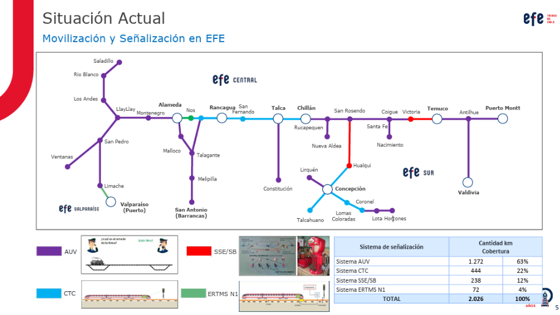

# Ficha técnica 
Nombre: Andrés Hernández.
## Fuente de los datos

Los datos fueron obtenidos mediante la presentación de la Empresa de los Ferrocarriles del Estado (EFE), en el Congreso Trenes y Metro 2024, de autoría de Gabriel Nilsson Cifuentes, Director del Proyecto Sistema Control por Señalización Virtual (CSV), en el que se muestra, mediante un mapa, la situación actual de la movilización y señalización en EFE en todo el país.

## Metodología de la construcción de la base

La base de datos fue una construcción propia, a raiz de la hipótesis grupal planteada. Esta significó encontrar datos que dieran cuenta de la realidad de la infraestructra de las vías férreas en nuestro país. 

Para tal propósito, logré obtener un mapa de EFE, que muestra la situación actual de movilización y señalización en los tramos actuales, que es un indicador clave que permite hacer una relación  entre atropellos y déficits estructurales en los cruces y vías.

*Situación actual EFE, 2024.*

No tan solo plasmé datos en una base a propósito de un mapa, sino que también busqué a través de herramientas como Google Maps las regiones en las que se ubicaban estos tramos, a fin de hacer el cruce con una base de datos que menciono en las observaciones más abajo.

# Alcance de los datos

Los datos son de gran ayuda para dar cuenta de la realidad nacional en cuanto al uso de los sistemas de señalización en las vías de EFE, los que no son los mismos dependiendo del tramo. 

Estos, al cruzarlos con los atropellos según región, dan luces de los déficits estructurales y son una vía de análisis según nuestra hipótesis planteada.

# Característica de los datos

Los datos ordenados y limpios muestran el tramo EFE, región en que se ubica el inicio de este tramo y el sistema de señalización, que utiliza siglas propias del sistema ferroviarios, que paso a detallar a continuación.

# Variables incorporadas
- Tramo EFE: Se evidencian 39 tramos a lo largo de todo Chile. Estos tramos dicen relación con el servicio completo de inicio y final, y no con todas las estaciones existentes que son intermedias a dicho tramo.

- Región de inicio tramo: Refiere a la región de inicio del tramo.

- Sistema de señalización: Refiere al equipamiento, personas, procedimientos e instalaciones destinado a administrar la movilización de trenes en forma eficiente y segura, según el [Reglamento](https://www.efe.cl/wp-content/uploads/2019/01/Reglamento-de-Tr%C3%A1fico-Ferroviario.pdf) de Tráfico Ferroviario (RTF) de EFE.

    Existen cuatro, que menciono a continuación:

    1. AUV: Autorización Uso de Vía.

        
        *EFE,2024*

    2. CTC: Control de Tráfico Centralizado.

        
        *EFE,2024*

    3. SSE/SB: Sistema Señalizado Eléctrico y Sistema Bastón.

        
        *EFE,2024*

    4. ERTMS N1: Sistema Europeo de Gestión del Tráfico Ferroviario (ERTMS), diseñado para controlar la velocidad de los trenes y aumentar la seguridad. Se basa en un sistema de comunicación intermitente entre la vía y el tren.

        
        *EFE,2024*

# Otras observaciones
Esta base de datos se debe cruzar con la presentada en mi primera entrega, la que también limpié para esta, que refiere a la [cifra](Datos_originales/Atropellos.csv) de fallecidos en siniestros ferroviarios del tipo "atropello", registrados en el ámbito nacional, durante el período comprendido entre los años 2017 a abril del presente año.

Junto con estar el desglose por regiones, presento las [causas](Datos_originales/Causas.csv) de estos atropellos y el [sistema de señalización total](<Datos_originales/Sistema de señalización total.csv>), con sus kilómetros de cobertura y porcentaje, también obtenido mediante documento de EFE del 2024.

