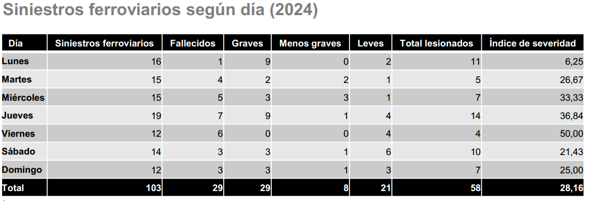
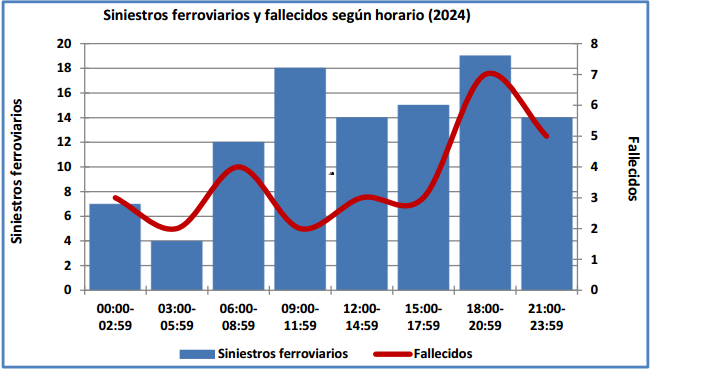
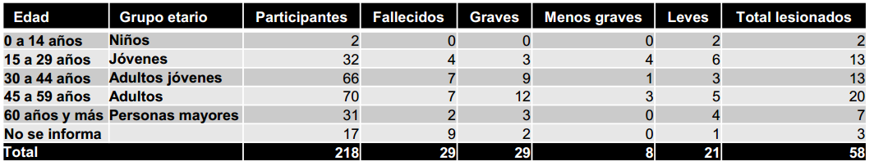

# Ficha Técnica de la Base de Datos
### Paloma Riquelme 

## Fuente de los datos
- **Organismo responsable:** Comisión Nacional de Seguridad de Tránsito (CONASET), Ministerio de Transportes y Telecomunicaciones de Chile.  
- **Tipo de fuente:** Datos oficiales provenientes de tablas incluidas en el documento *Siniestros Ferroviarios 2024*.  
- **Archivo original:** *Siniestros-Ferroviarios-2024.pdf*  
- **Fecha de publicación:** 2024.  
- **Contacto oficial:** observatorio@mtt.gob.cl  

## Metodología de construcción de la base

De este archivo solo se utilizaron **tres tablas específicas**:  
- Tabla por **día de la semana**.  
- Tabla por **grupo etario**.  
- Tabla por **franja horaria**.

El archivo final fue construido a partir de las tres tablas extraídas manualmente desde el PDF. El objetivo fue **consolidar la información dispersa** en un solo archivo limpio y listo para análisis.

## Alcance de los datos

- **Cobertura temporal:** Enero – Diciembre 2024.  
- **Cobertura geográfica:** Nivel nacional (sin desagregación por región o comuna).  
- **Unidad de análisis:** Cada fila representa un registro asociado a:
  - Un día específico,
  - Un grupo etario,
  - O una franja horaria.  
- **Información incluida:**
  - Número de siniestros.
  - Número de fallecidos.
  - Número de lesionados (graves, menos graves y leves).

## Características de los datos
- **Total de registros en la base unificada:**  
  - 24 filas combinadas:  
    - 7 filas correspondientes a días de la semana.  
    - 6 filas correspondientes a grupos etarios.  
    - 8 filas correspondientes a horarios.  
    - 3 filas de control y totales.

- **Nivel de detalle:** Datos resumidos y agregados a nivel nacional.

## Variables incorporadas

| Variable                | Descripción                                                                 |
|-------------------------|-----------------------------------------------------------------------------|
| **categoria**           | Identifica el tipo de tabla de origen: **DIA**, **EDAD**, **HORARIO**           |
| **Subcategoria**       | Nombre específico (ejemplo: "Lunes", "15-29 años", "18:00-20:59").         |
| **Siniestros**         | Número de siniestros registrados en esa categoría.                         |
| **Fallecidos**       | Número de personas fallecidas.                                             |
| **Lesionados graves**    | Personas con lesiones graves.                                              |
| **Lesionados menos graves** | Personas con lesiones menos graves.                                     |
| **Lesionados leves**   | Personas con lesiones leves.                                               |
| **Total lesionados**  | Total de lesionados (suma de graves, menos graves y leves).                |
| **Indice severidad**   | Indicador calculado por CONASET: víctimas fatales por cada 100 siniestros. |

### Otras observaciones
- La base **no contiene información individualizada**, solo cifras agregadas.
- Los datos permiten estudiar patrones generales de siniestros ferroviarios, pero no es posible desagregar por región, comuna o tipo de siniestro. El hecho de trabajar con datos agregados implica que no se pueden realizar análisis individuales, pero sí es posible identificar tendencias y patrones de riesgo.
- Las categorías `"No se informa"` en la sección de edad corresponden a casos en que no se logró registrar el dato.

* La combinación de las tres dimensiones (edad, horario y día) da pie a construir indicadores más avanzados para la historia.
