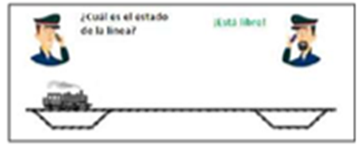
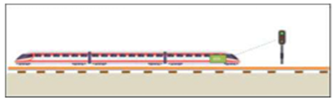

## Crónica 

**Integrante**: Andrés Hernández

Todos los años mueren personas atropelladas en las vías férreas de nuestro país. Estas cifras no son conocidas públicamente y demuestran que no solo hay imprudencias del peatón involucradas, sino que fallas estructurales del sistema ferroviario chileno, como un sistema de señalización poco seguro para evitar siniestros.

Según cifras de 2017 a abril del presente año, la mayor cantidad de fallecidos en siniestros ferroviarios del tipo atropello se han producido en las regiones Metropolitana, O'Higgins y Maule, respectivamente. En estas, los dos sistemas de señalización más utilizados en sus tramos son, según la Empresa de Ferrocarriles del Estado (EFE), el Autorización Uso de Vía (AUV) y Control de Tráfico Centralizado (CTC).

AUV, según la [revista](https://www.revistaentren.cl/wp/wp-content/uploads/2022/03/Revista-En-Tren-14.pdf) En Tren, es el sistema “más simple", especialmente en la red de vías únicas. Es una comunicación entre el controlador de tráfico y el personal del tren. La autorización incluye puntos de referencia exactos (como cambios de vía o postes) desde donde se extiende la autorización. El personal del tren debe repetir la información al controlador para su confirmación antes de que se autorice el movimiento del tren.

_EFE, 2024_

El CTC, según el [Reglamento](https://www.efe.cl/wp-content/uploads/2019/01/Reglamento-de-Tr%C3%A1fico-Ferroviario.pdf) de Tráfico Ferroviario de EFE, posee una señalización luminosa constituida por señales absolutas y no absolutas que solamente se encienden cuando son requeridas. Cuando no son requeridas reposan en su estado más restrictivo (señales absolutas, siempre con su foco alumbrando en aspecto Rojo solo y señales no absolutas siempre con su foco alumbrando en aspecto Amarillo solo).

_EFE, 2024_

Ambos sistemas presentan debilidades para prevenir atropellos, mostrando que la señalización no es suficientemente segura para alertar o proteger a los peatones, lo cual es coincidente con las cifras de fallecidos en siniestros ferroviarios del tipo atropello. En el caso de AUV, existe una alta dependencia en el error humano y falta de automatización, lo que reduce la capacidad de respuesta rápida y segura ante situaciones imprevistas.

El sistema CTC, aunque más complejo con señales luminosas y enclavamientos, opera con limitaciones técnicas relevantes. Según un [artículo](https://blog.institutoferroviario.cl/accidente-ferroviario-entre-nos-y-buin-causas-reales-o-aparentes-f0fabd96f97a) en el blog del Instituto Ferroviario chileno, se menciona que “La delincuencia organizada que roba constante e impunemente catenaria y cables subterráneos de los sistemas de señalización de EFE en sectores de plena vía, lo cual obliga a no emplear las vías afectadas en sectores de vía doble (…) o genera situaciones no deseadas, tales como fallas y degradaciones del sistema de Control de Tráfico Centralizado (CTC), las cuales fuerzan movilizaciones con sistemas análogos, radiales o telefónicos que no aseguran un funcionamiento a prueba de fallas (fail safe) como sí ocurre con el CTC a plena capacidad”.
